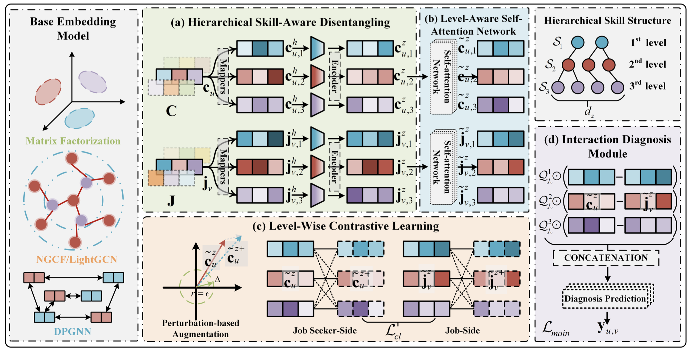
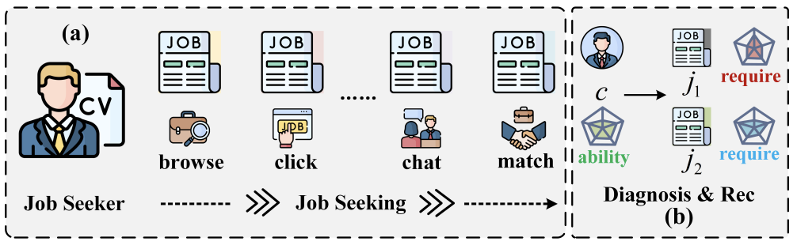

## DISCO: A Hierarchical Disentangled Cognitive Diagnosis Framework for Interpretable Job Recommendation
:clipboard: The code in this repository is the implementation of the proposed DISCO framework accepted by ICDM-2024, where one of the datasets used Edu-Rec is publicly available, details of which can be found in the paper description.

:rocket: Paper: [DISCO-PAPER-PDF](https://arxiv.org/abs/2410.07671)
***


***

### DISCO Description

We propose a novel framework termed as DISCO (a hierarchical Disentangling based Cognitive diagnosis framework), which aims to flexibly accommodate the underlying representation learning model for job recommendations. 



Our approach comprises several key components. Initially, we designed a hierarchical representation disentangling module to mine the hierarchical skill-related factors embedded in the representations of job seekers and jobs. To further enhance information communication and robust representation learning, we proposed the level-aware association modeling, which consists of the inter-level knowledge influence module and level-wise contrastive learning. we devised an interaction diagnosis module is introduced that integrates a neural diagnosis function, aimed at effectively capturing the multi-level recruitment interaction process between job seekers and jobs. Finally, we developed an interaction diagnosis module incorporating a neural diagnosis function for effectively modeling the multi-level recruitment interaction process between job seekers and jobs, which introduces the cognitive measurement theory. Extensive experiments on two real-world recruitment recommendation datasets and an educational recommendation dataset clearly demonstrate the effectiveness and interpretability of our proposed DISCO framework. 

### Usage

Download the public dataset and preprocessing according to the detailed description in the paper, and place it in the directory `./datas/{dataset_edu-rec}`.

Train & Test model:
```
python3 train_ngcf.py --model_name "ngcf_disco" --dataset_name "edu_rec" --lr 8e-4 --batch_size 512 --epoch 80 
```

### Reference :thought_balloon:

Xiaoshan Yu, Chuan Qin, Qi Zhang, Chen Zhu, Haiping Ma, Xingyi Zhang, and Hengshu Zhu. "DISCO: A Hierarchical Disentangled Cognitive Diagnosis Framework for Interpretable Job Recommendation" 2024 IEEE International Conference on Data Mining (ICDM), 2024.

### Bibtex

```
@inproceedings{DISCO,
title={DISCO: A Hierarchical Disentangled Cognitive Diagnosis Framework for Interpretable Job Recommendation},
author={Yu, Xiaoshan and Qin, Chuan and Zhang, Qi and Zhu, Chen and Ma, Haiping and Zhang, Xingyi and Zhu, Hengshu},
booktitle={2024 IEEE International Conference on Data Mining (ICDM)},
  year={2024},
  organization={IEEE}
}
```